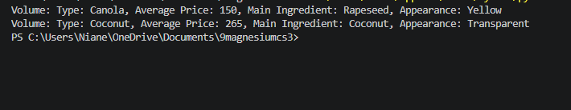
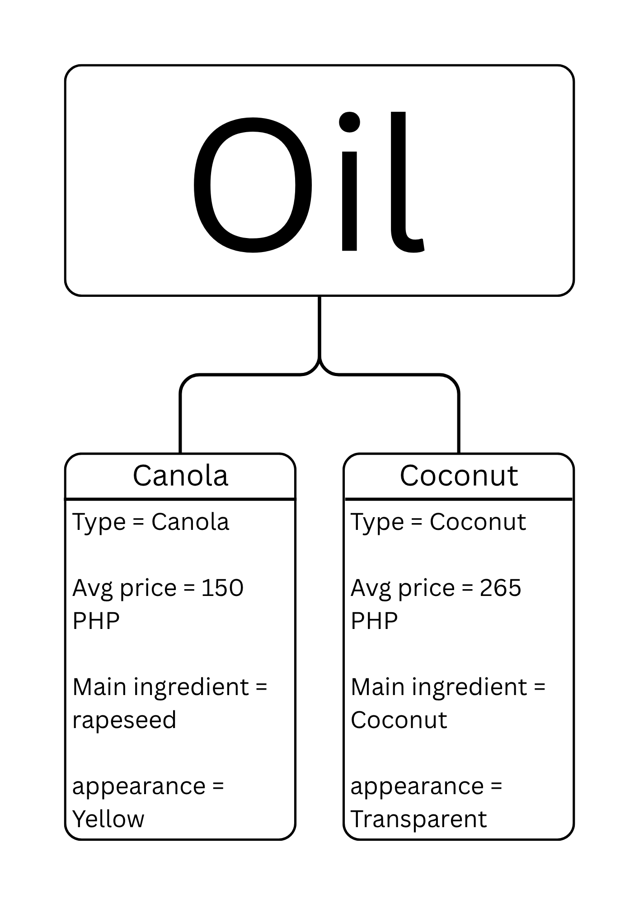

# Class Attributes and Methods
## Previous Design
Link to my previous activity:
[classObjectUML.md](https://github.com/paul-rigunay/9berylliumcs3/blob/main/q1%20/classObjectUML.md)
## Design Revision
Describe any changes made to your original class.
## Visibility Decisions
| Attribute | Data Type | Visibility | Reason |
|---|---|---|---|
| type | string | Public | The type relies on the ingredients |
| average price | integer | Private | Average price cannot be changed directly unless theres factors like inflation |
| main ingredient | string | Private | If I change the ingredient, it would become a different type of oil |
| appearance | string | Public | I can see the appearance of the oil |
## Updated UML Class Diagram

## Python Implementation

[View Python Source](https://github.com/paul-rigunay/9berylliumcs3/blob/main/q1%20/classImplementation.py)
## Test Run

## Object Diagram

## Analysis
### Why did you make your chosen attribute private?
- The chosen attributes were chosen private because its to use encapsulation and protect the code from the outside.
### Which method changes the state of your object?
- The use_discount_coupon changes the self.average_price
### How did your two objects demonstrate that instances are independent?
- 
### What is the difference between your class diagram and your object diagram?
