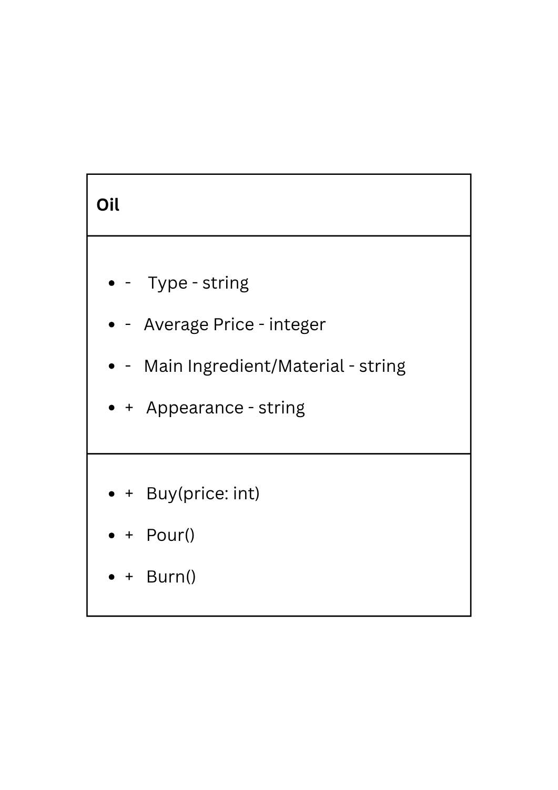

# SG4 - Understanding Classes and Objects
## Class Name: Oil
## Class Description: Every oil has a name, an average price, a type, a main ingredient/material, and appearance (type of color/colorless)
## Properties
| Property | Data Type | Description |
|          type          |  string  |  The type of oil (examples: olive oil, motor oil)  |
|      average price     |  integer |  The average price of the oil around the world  |
|main ingredient/material|  string  |  The main ingredient or material used in making the oil  |
|        appearance      |  string  |  The appearance of the oil (examples: yellow, transparent)  |
## Methods
| Method | Description |
|  Buy  |  Buys the oil  |

|  Pour  |  Pours the oil  |
|  Burn  |  Burns the oil (why)  |
## Class Diagram

## Design Explanation
### Why did you choose this class?
I chose this class because oil was the first thing that came to my mind and oil can be classified and be used in many ways. I also chose this because my first option had little methods.
### Which property is the most important? Why?
The type property is the most important because different types of oil are used for different types of problems and misusing them can lead to horrible events, just like using motor oil for cooking.
### Which method is the most useful? Why?
The main ingredient or material is the most useful because it forms the different types of oils.
