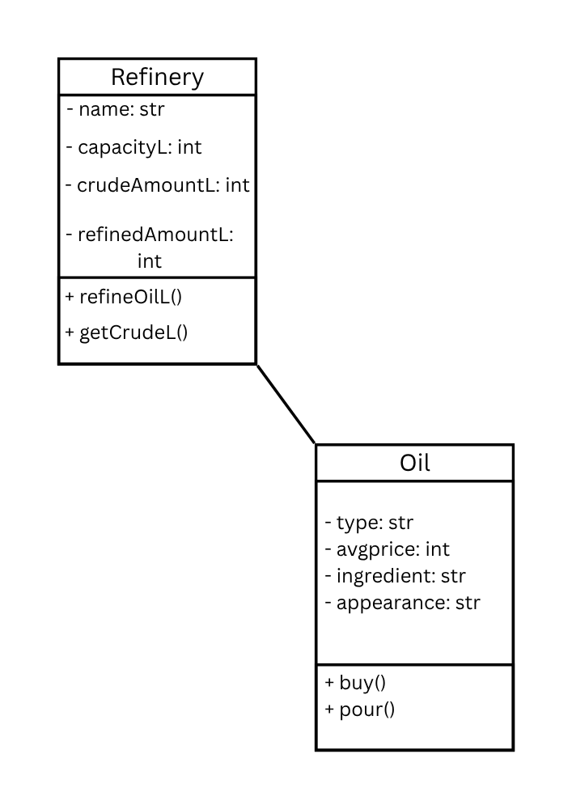

# Class Relationships: Association and Multiplicity
## Previous Work
[Part I - Classes and Objects](classObjectUML.md)
[Part II - Class Attributes and Methods](classAttributesMethods.md)
## Existing Class
Class: Oil
Description: All oils have a type, an average price, a main ingredient, and an appearance.
## New Related Class
Class: Oil Refinery
Description: All Oil Refineries have oil.
## Association
Relationship: Oil Refinery HAS Oil
Explanation: All oil refineries have oil, unless if the place runs out of oil.
## Multiplicity
Multiplicity: One-to-Many (1 to 0..*)
Explanation: Because oil can be transferred into a refinery but a refinery cannot be transferred into an oil, because oils aren't machines.
-  LLM was used here: 

## UML Class Relationship Diagram

## Python Implementation
[View Python Source](classRelationships.py)
## Test Run

## Object Relationship Diagram

## Analysis
### What is the association between your two classes?
### What multiplicity did you choose and why?
### How did you implement the relationship in Python?
### Why did you store an object reference instead of copying its data?
### If your relationship uses many, why is a list appropriate?
